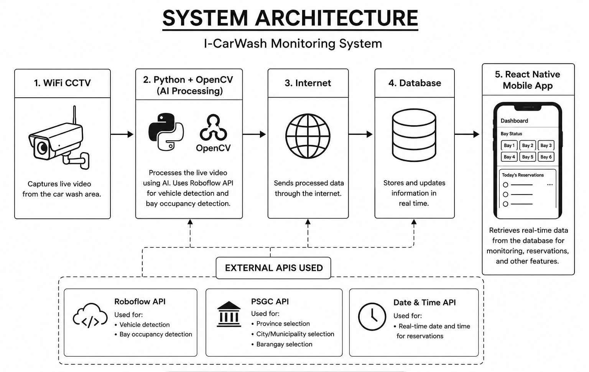

# I-CarWash: A Computer Vision-Based Monitoring System for Carwash Enterprises

##  Members
- Gilbert T. Aquino
- Mark Edzon G. Araojo
- Gilbert Bumanglag Jr.


## Introduction

This capstone project develops a **Computer Vision-Based Monitoring System** that automates carwash operations using **Artificial Intelligence (AI)** and **Computer Vision (CV)**. The system detects bay occupancy, records service duration, manages customer queues, and provides real-time monitoring through a digital dashboard, improving operational efficiency and customer experience.


## Purpose

The project aims to:

- 🚘 Automate bay occupancy monitoring
- ⏱️ Record service duration automatically
- 📊 Provide digital sales and operational monitoring
- 📱 Improve customer reservation management


## Scope

The system is designed for **small and medium-sized carwash businesses** and includes:

- Real-time vehicle detection
- Automated service timing
- Digital monitoring dashboard
- Sales recording
- Customer reservation


## Definitions, Acronyms, and Abbreviations

| Term | Description |
|------|-------------|
| **AI** | Artificial Intelligence |
| **CV** | Computer Vision |
| **Object Detection** | Identifies vehicles through camera images. |
| **Bay Occupancy** | Detects whether a washing bay is occupied or vacant. |
| **SDLC** | System Development Life Cycle |
| **Waterfall Model** | A sequential software development approach. |


## System Architecture

The diagram below illustrates the overall architecture and data flow of the **Computer Vision-Based Monitoring System for Carwash Enterprises**.

<p align="center">
  
</p>

### Workflow

1. **WiFi CCTV Camera** captures the live video feed from the carwash area.
2. **Python with OpenCV** processes the video frames and sends them to the **Roboflow AI Inference API**.
3. **Roboflow** detects vehicles and determines the occupancy status of each washing bay.
4. The processed data is transmitted over the **Internet** and stored in the **Database**.
5. The **React Native Mobile Application** retrieves the latest data, allowing administrators and staff to monitor bay occupancy, reservations, and other operational information in real time.

## Software perspective and functions

1. Customer Reservation: Manages all
bookings made by clients ahead of time.

2. New Walk-In: Caters to customers
who arrive at the car wash station without any prior reservation.

3. Home Service: Manages car wash services requested and done directly at the customer's
home or location.


## Use case characteristics & other diagrams


## ⚠️ Constraints

The system operates under the following constraints:

- A stable **internet connection** is required for real-time synchronization between the AI server, database, and mobile application.
- A **WiFi CCTV camera** must be installed and operational for continuous vehicle monitoring.
- AI detection accuracy depends on the **camera's placement, viewing angle, and video quality**.

---

## 🚧 Limitations

The current version of the system has the following limitations:

- The AI model can classify only the **vehicle type** (e.g., sedan, SUV, pickup, van, or motorcycle).
- The system **cannot identify the vehicle's brand or specific model**.
- The system **does not perform Automatic License Plate Recognition (ALPR)**.
- Detection accuracy may decrease under:
  - Poor lighting conditions
  - Camera obstruction
  - Low-resolution video
  - Extreme weather conditions (if installed outdoors)

---

## 📦 Dependencies

The project relies on the following technologies and services:

- 📷 WiFi CCTV Camera
- 🐍 Python 3.x
- 🎥 OpenCV
- 🤖 Roboflow Inference API
- ☁️ Stable Internet Connection
- 🗄️ Supabase Database
- 📱 React Native (Expo)


## ✨ System Features 
The system provides the following core features: 
- 🔐 User Login
- 📝 User Registration
- 📊 Dashboard for all user roles
- 🗄️ Database integration
- 👥 Staff Management
- 🏠 Home Service Reservation
- 🤖 AI Vehicle Detection (Computer Vision)
- 🚗 Walk-in Vehicle Monitoring
- 🅿️ Real-Time Bay Availability Display
- 🔔 Notification and Action Modal Windows
  
## 🖥️ Interface Requirements 
The user interface is designed to be simple, responsive, and user-friendly. 
- Easy-to-use reservation form - Real-time display of available washing bays
- Login and registration forms with input validation
- Walk-in monitoring page displaying AI-detected vehicles
- Dedicated dashboards for:
- - 👤 Customer
  - 👨‍🔧 Staff
  - 🏢 Owner
  - 🛠️ Administrator


## ⚙️ Non-Functional Requirements

- 🔒 Secure user authentication
- 🔐 Encrypted password storage
- ⚡ Real-time data synchronization
- 📈 Reliable system performance
- 👨‍💻 User-friendly interface


## 📌 Other Requirements

The system depends on the following third-party services, APIs, and libraries:

- 🗄️ **Supabase** – Cloud-based backend service used for database management, user authentication, and real-time data synchronization.
- 🤖 **Roboflow Inference API** – AI-powered object detection service used to identify vehicles and determine washing bay occupancy from CCTV video feeds.
- 🗺️ **Philippine Standard Geographic Code (PSGC) API** – Provides standardized Philippine location data (Region, Province, City/Municipality, and Barangay) for customer registration and reservation forms.
- 🕒 **Date and Time API** – Supplies accurate date and time information for recording reservations, service duration, transaction history, and monitoring logs.
- 🎥 **OpenCV** – Open-source computer vision library used for capturing and processing video frames before AI-based vehicle detection.


```
> Bachelor of Science in Information Technology

